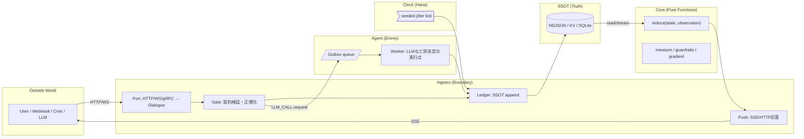

# Architecture

この文書は Resonance OS / Lighthouse の**設計意図**と**モジュール分解**を説明します。  
キーワードは **Boundary / Core / Clock / Agent / SSOT** と **Deterministic Replay**。

---

## 全体像（高レベル）



- **Ingress** は「**受信 → 検証 →append**」に徹し、**SSE** で状態を外へ配信
- **Core** は**純粋関数**のみ（I/O 禁止）で `state` を導出
- **Agent** は **Outbox** を唯一の実行点にし、**request/response を観測として保存**（完全リプレイ可能）
- **Clock** は**決定化された tick** を発生（RNG_SEED）

---

## 契約（Contract）

### Observation（観測）

```ts
type Observation = {
  id: string; // 一意ID
  t: string; // ISO8601
  type: string; // ex) "add" | "tick" | "LLM_CALL.request" | "LLM_CALL.response"
  payload?: unknown;
  provenance?: Record<string, unknown>; // 署名・発火元・ハッシュ等
};
```

### State（状態）

```ts
type State = {
  counter: number;
  // 将来: timeline index / projections / metrics ...
};
```

> **不変条件**：Core は Observation だけを受け取り、**決定的**に State を返す。I/O は持たない。

---

## Ingress（Boundary）

- **Port**: HTTP/WS/gRPC から内部 `Dialogue` 形式へ変換
- **Gate**: スキーマ検証・認証/署名（Web Crypto HMAC など）・idempotency
- **Ledger**: **唯一の書き込み窓口**。SSOT へ append / replace
- **Push**: SSE/HTTP の応答整形

**やらないこと**：ビジネス判断・状態計算（それは Core）

**公開エンドポイント（最小）**

- `POST /observation` … 受信 → 検証 →append（204）
- `GET /events` … SSE（`data: {state}`）
- `GET /snapshot` … `{ observations, count }` or `{ timeline, state }`
- `POST /replay` … `{ timeline }` を置換 → 状態再計算

---

## Core（Pure Functions）

- `reduce(state, observation)` … 唯一の状態遷移関数
- `measure.ts` / `guardrails.ts` / `gradient.ts` … 評価・保護・探索の純計算補助
- **テスト**：入出力の**スナップショットテスト**だけで高い信頼性

> 例）`type === "add"` なら `state.counter += payload.n`、`type === "tick"` で `+1` など。

---

## SSOT（Single Source of Truth）

同一のインターフェース `SSOT` に対して**3 実装**を切替：

- **NDJSON**: 最小コストで始める。`observations.ndjson` / `outbox.ndjson` / `outbox_done/`
- **KV**: Deno KV（不安定 API）。高速な key-value アクセス
- **SQLite**: クエリ/集計が必要になった時に移行

**原則**

- **append-only**（観測の履歴は消さない）
- リプレイ時は明示的に `replaceTimeline()` を行い、`/snapshot` と **一致**することを CI で検査

---

## Agent（Emmy / Actor）

- **Outbox パターン**を採用

  - Ingress/Gate が `LLM_CALL.request` を **Outbox** に enqueue（観測としても保存）
  - **Worker** が唯一の実行点として LLM/API を呼び出し、`LLM_CALL.response` を観測として保存

- こうすると **再実行は履歴だけで完全再現**できる（外部 API を殴らない）

**備考**

- 失敗時は再試行（attempts, backoff）
- 署名・レート制限は Gate で吸収

---

## Clock（Hana）

- `RNG_SEED` を用いて **jitter を決定化**
- デモ/検証で**再現可能なタイムライン**を作る装置
- 本番では OS の cron / queue に置替え可（契約が同じなら swap 可能）

---

## 決定的リプレイ（Deterministic Replay）

- **乱数・時刻・LLM 応答**など**非決定要素のすべて**を Observation として**固定化**する
- Core は**純粋関数のみ**のため、**同じ履歴 → 同じ状態**が保証される
- CI では `/snapshot` → `/replay` の**一致テスト**を回す

---

## セキュリティ / 実運用 Tips

- Gate で HMAC 署名／時刻ずれ検査（5 分以内等）／idempotency key
- 権限モデルは Deno の `--allow-*` と `deno.json` の `permissions` で制御
- マルチプロセス化時は SSE の裏に Pub/Sub を挟む（例：Redis, NATS, Cloud Pub/Sub など）

---

## 今後の拡張

- Projections（集計ビュー）と Retention（古い観測の圧縮）
- 署名付き Provenance（Supply-chain: SBOM 連携）
- KV/SQLite のトランザクション戦略の最適化
- `agent` のツール実行（コード/コマンド/外部検索）と拘束条件（guardrails）の強化

---

## まとめ

- **Boundary** と **Core** を堅牢に分け、**非決定**を **Agent** に隔離し、**SSOT に事実を積む**
- **Clock** で時間の再現性を担保、**CI でリプレイ一致**を自動検査
- 小さく始めて、**契約を壊さず**に NDJSON → KV/SQLite へ**段階的に進化**できるアーキテクチャ
