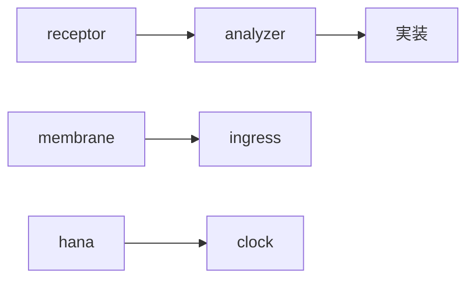
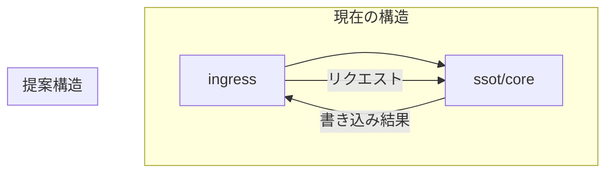

## **architecture.md との比較分析**

### **1. 用語の不一致問題**



- **用語変更**は技術的には正しいが、**ドキュメントとの不一致**が混乱を招く
- **用語マッピング表**の作成を推奨

### **2. モジュール責任の曖昧さ**

```typescript
// modules/ingress の過剰な責任
class Ingress {
  handleProtocol() {} // port.ts: OK
  validateInstant() {} // gate.ts: OK
  appendToSSOT() {} // ledger.ts: ❌ SSOT責任ではない
  formatResponse() {} // push.ts: OK
}
```

- `ledger.ts` の SSOT 書き込みは **SSOT モジュールの責任** であるべき
- Ingress は**変換と検証**に集中すべき

---

## **具体的な改善提案**

### **1. SSOT への責任集中**



```typescript
// modules/ssot/core.ts（新規作成）
class SSOTCore {
  private adapter: SSOTAdapter;

  async append(obs: Observation): Promise<AppendResult> {
    // バリデーション
    // 変換
    // アダプターへの委譲
    return await this.adapter.append(obs);
  }
}
```

### **2. 設定ファイルの整理**

```shell
.config/
├── policies/           # ✅ 良い
├── allowed_signers/    # ✅ 良い
└── routes/            # ➕ 追加提案: ルート定義
    ├── api.yaml       # REST APIルート
    └── internal.yaml  # 内部ルート
```

### **3. スクリプトディレクトリの整理**

```shell
scripts/
├── dev/              # 開発用スクリプト
│   ├── bootstrap.sh
│   └── test-commands.sh
├── deploy/           # デプロイ用スクリプト
│   ├── build.sh
│   └── release.sh
└── tools/            # ユーティリティ
    ├── sbom.sh
    └── snapshot.sh
```

### **4. 型定義の一貫性**

```typescript
// modules/shared/contracts/observation.ts
interface Observation {
  id: string;
  nodeId: string;
  author: string;
  payload: unknown; // ❌ anyやunknownは避ける
  tags: string[];
  createdAt: string; // ❌ DateTime型を定義すべき
}

// 改善案
interface Observation<T = JsonValue> {
  id: ObservationId; // 専用型
  nodeId: NodeId; // 専用型
  author: UserId; // 専用型
  payload: T; // ジェネリックで型安全
  tags: Tag[];
  createdAt: DateTime;
}
```

---

## **セキュリティ観点の指摘**

### **1. 設定ファイルの保護**

```shell
.config/
├── policies/
│   └── check_signoff.ts  # ❌ TSファイルは実行可能
```

- **設定はデータであるべき**（JSON/YAML 推奨）
- 実行可能コードは **別ディレクトリ** に分離

### **2. ログファイルの管理**

```shell
logs/  # ❌ 空ディレクトリ？ログ戦略が必要
```

- **ログローテーション**戦略の定義
- **敏感情報マスキング**の実装

---

## **テスト容易性の改善**

### **1. モジュール間の結合度**

```typescript
// 現在: 密結合
import { ssotAdapter } from "../ssot/adapters/ssot_kv.ts";

// 提案: 依存性注入
interface SSOTDependencies {
  ssot: SSOTCore;
}

function createIngress(deps: SSOTDependencies) {
  // deps.ssotを使用
}
```

### **2. テストデータ管理**

```shell
test/
├── data/              # テストデータ
│   ├── observations/  # 観測テストデータ
│   └── expected/      # 期待結果
└── fixtures/          # テストフィクスチャ
    ├── ssot/          # SSOT設定
    └── ingress/       # Ingress設定
```

---

## **パフォーマンス考慮事項**

### **1. NDJSON のスケーラビリティ**

```typescript
// ssot_ndjson.ts の潜在的問題
class SSOTNDJSONAdapter {
  async append(obs: Observation) {
    // 毎回ファイルを開くのは非効率
    await Deno.writeTextFile("data.ndjson", JSON.stringify(obs) + "\n", {
      append: true,
    });
  }
}
```

- **バッファリング**実装の提案
- **定期的なフラッシュ**機制の導入

### **2. メモリ使用量**

```typescript
// 全観測データのメモリ読み込み回避
async function* readObservations() {
  // ストリーミング処理
  for await (const line of Deno.readTextFile("data.ndjson")) {
    yield JSON.parse(line);
  }
}
```

---

## **まとめ：優先的な改善点**

1. **責任分離の明確化**: Ingress から SSOT 操作を分離
2. **型安全性の向上**: 専用型の導入と any の排除
3. **設定管理の改善**: コードと設定の分離
4. **テスト環境整備**: テストデータとフィクスチャの整備
5. **ドキュメント同期**: 用語の統一とアーキテクチャ文書の更新

現状でも非常に優れた構造ですが、これらの改善で **より堅牢で保守しやすいシステム** になるでしょう。
